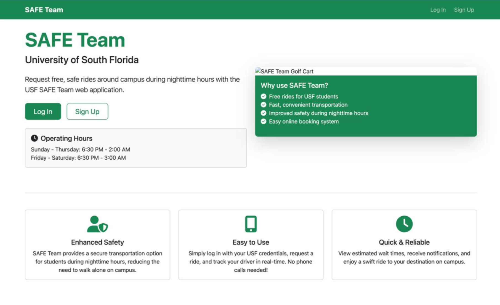
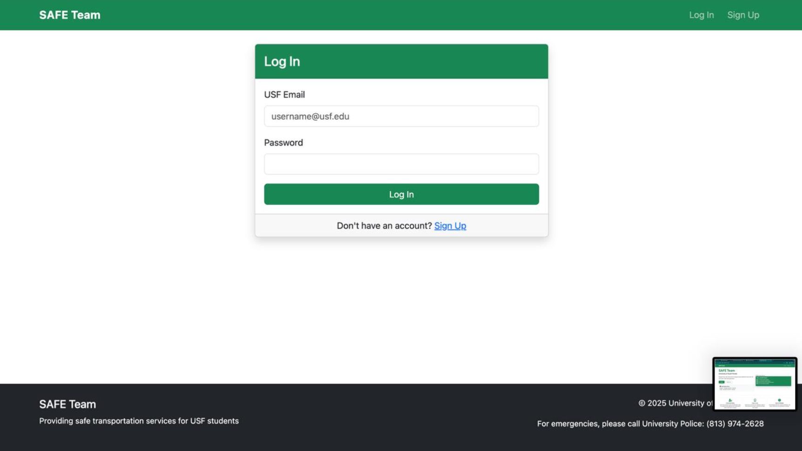
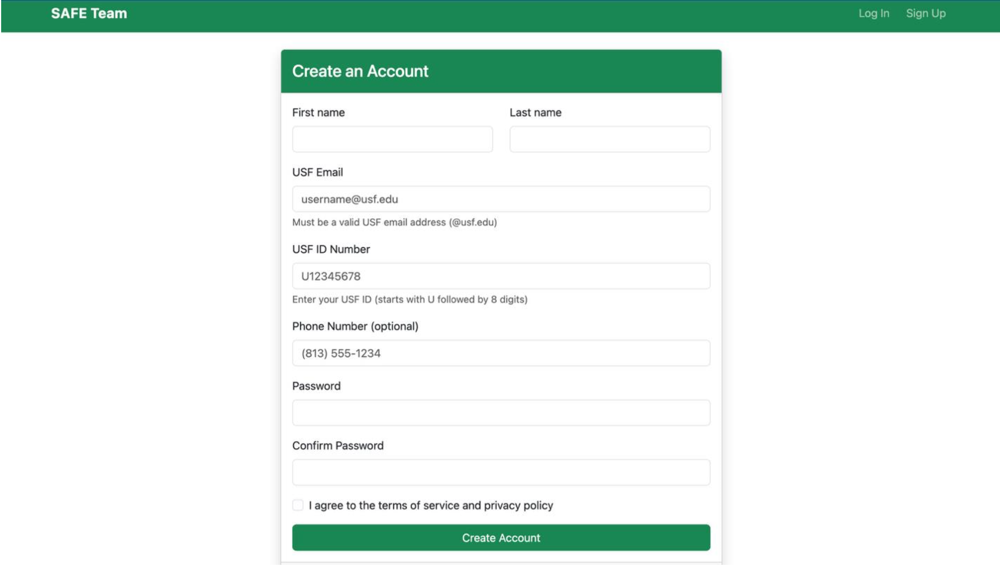
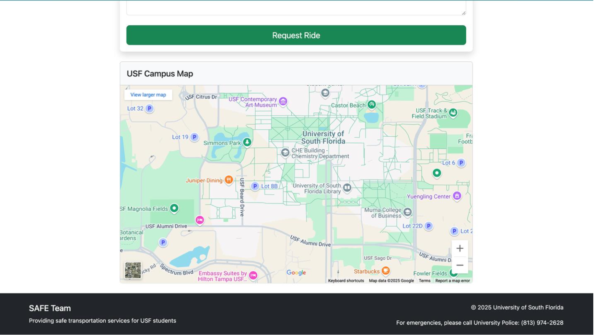
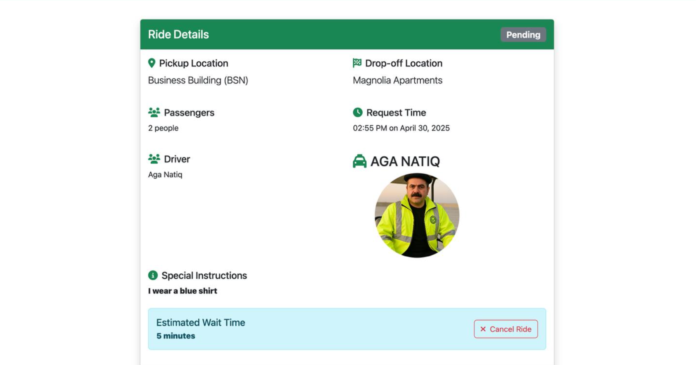

# SAFE Team Ride Service Web App

A Ruby on Rails web application designed to modernize university SAFE Team transportation services.

## Problem & Impact

Traditional campus SAFE Team ride requests rely on phone calls, leading to long wait times and inefficient dispatching.

This application modernizes the process by:

- Digitizing ride requests
- Reducing dispatcher workload
- Improving transparency with real-time updates
- Enhancing campus safety through structured tracking

## Features

- **User Authentication**: Secure login with USF credentials
- **Ride Requests**: Simple interface for requesting rides around campus
- **Wait-Time Estimation**: Real-time updates on expected wait times
- **Request Tracking**: Follow the status of your ride in real-time
- **Notifications**: Receive updates when a driver accepts your ride or arrives
- **Driver Interface**: Drivers can view and manage ride requests
- **Admin Dashboard**: Administrators can manage users, rides, and locations

## 📸 Application Screenshots

### Landing Page


### Login


### Sign Up


### Campus Map


### Ride Details



## Technologies Used

- Ruby 3.2.2
- Rails 7.0.7
- SQLite (development) / PostgreSQL (production)
- Bootstrap 5
- Hotwire (Turbo & Stimulus)
- RSpec for testing

## 🚀 Getting Started

### Prerequisites

- Ruby 3.2.2 or higher
- Rails 7.0.7 or higher
- SQLite3
- Node.js
- Yarn

### Installation

1. Clone the repository:
   ```bash
   git clone https://github.com/Kylefan123/safe-team-usf-portfolio.git
   cd safe-team-usf-portfolio
   ```

2. Install the dependencies:
   ```bash
   bundle install
   yarn install
   ```

3. Set up the database:
   ```bash
   rails db:create
   rails db:migrate
   rails db:seed
   ```

4. Start the server:
   ```bash
   rails server
   ```

5. Visit `http://localhost:3000` in your browser

### Test Accounts

After running the seed data, you can log in with the following test accounts:

- Student: student1@usf.edu / password
- Driver: driver1@usf.edu / password
- Admin: admin@usf.edu / password

## Development

### Running Tests

```bash
bundle exec rspec
```

### Code Style

This project uses Rubocop for Ruby code style enforcement:

```bash
bundle exec rubocop
```

## 📦 Deployment

See [DEPLOYMENT.md](DEPLOYMENT.md) for detailed deployment instructions.

## 🛠 Tech Stack

**Backend**
- Ruby 3.2.2
- Rails 7.0.7
- PostgreSQL (production)
- SQLite (development)

**Frontend**
- Bootstrap 5
- Hotwire (Turbo & Stimulus)

**Testing & Quality**
- RSpec
- RuboCop
- GitHub Actions (CI)

## 🧠 System Design Highlights

- MVC architecture using Rails conventions
- Role-based authorization (Student, Driver, Admin)
- RESTful routing and resource controllers
- Background processing for ride notifications
- Database indexing for optimized ride queries


## Project Structure

- `app/models` - Database models and business logic
- `app/controllers` - Request handling and application flow
- `app/views` - UI templates and components
- `app/javascript` - JavaScript/Stimulus controllers
- `app/assets` - Stylesheets, images, and other assets
- `config` - Application configuration
- `db` - Database migrations and seeds
- `spec` - Test files


## License

This project is licensed under the MIT License - see the LICENSE file for details.

## Inspiration

Inspired by the University of South Florida SAFE Team transportation service.

